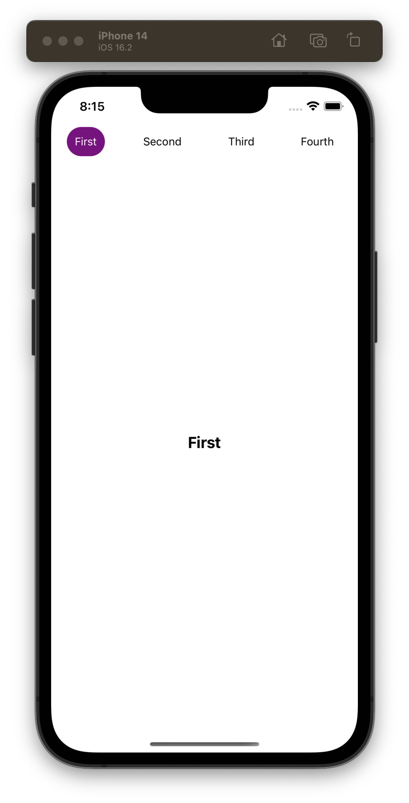

# react-native-tab-view

Tab view

## Installation

```sh
npm install react-native-tab-view
```

## Demo



## Usage

```js
import * as React from 'react';

import { StyleSheet, View, Text, SafeAreaView } from 'react-native';
import { TabView } from '@fausto95/react-native-tab-view';

const routes = [
  { key: 'first', title: 'First' },
  { key: 'second', title: 'Second' },
  { key: 'third', title: 'Third' },
  { key: 'fourth', title: 'Fourth' },
];

export default function App() {
  return (
    <TabView
      tabBarStyle={styles.tabBarStyle}
      tabBarContentContainerStyle={styles.tabBarContentContainerStyle}
      style={{ flex: 1 }}
      routes={routes}
      onPress={(index) => console.log(index)}
      renderTabBar={({ route, isActive }) => (
        <View
          style={[styles.tab, isActive ? { backgroundColor: 'purple' } : {}]}
        >
          <Text style={[{ color: isActive ? 'white' : 'black' }]}>
            {route.title}
          </Text>
        </View>
      )}
      renderScene={(route) => (
        <View style={styles.scene}>
          <Text style={styles.text}>{route.title}</Text>
        </View>
      )}
    />
  );
}
```

## Contributing

See the [contributing guide](CONTRIBUTING.md) to learn how to contribute to the repository and the development workflow.

## License

MIT

---

Made with [create-react-native-library](https://github.com/callstack/react-native-builder-bob)
